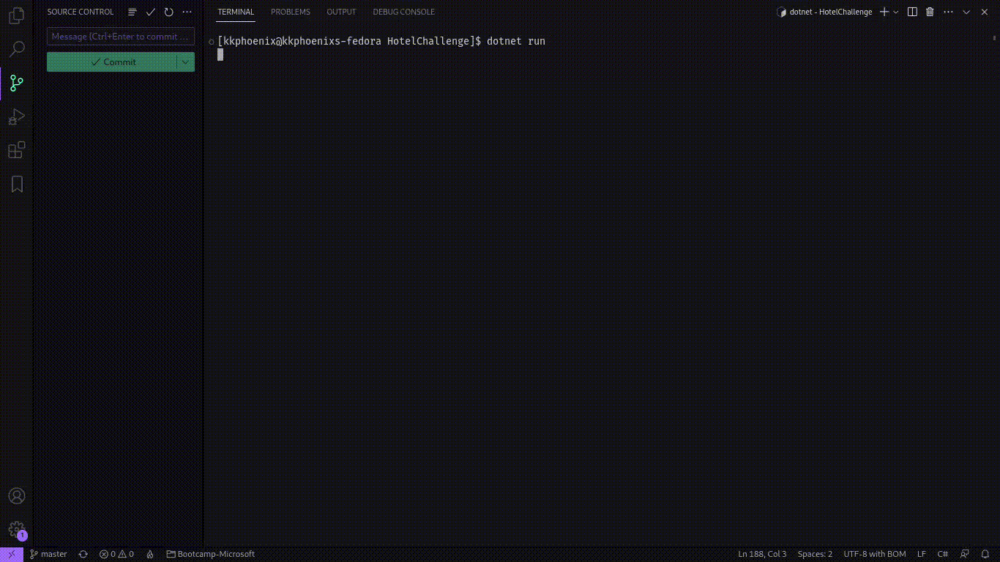
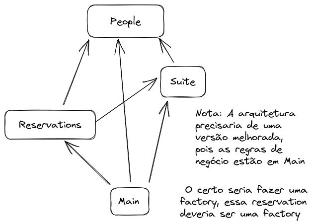

# Hotel Challange

Project View:

 

 

## Architecture

## Implement later if need

* Create a database to the system. Operations that we have to do after create it:
  * Create a way to delete people in the suite and automatically do it when the diaryDate comes
  * Could be a way to recuperate data and do not come again to the start